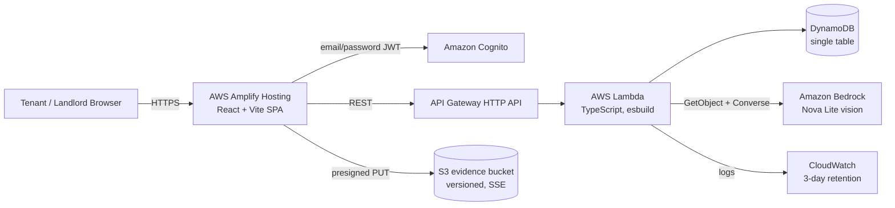

# Makaan — Project Plan

> **Status:** Founding blueprint, v1.0
> **Date:** 2026-09-19
> **Name:** **Makaan** (chosen; see §2)
> **One line:** Proof, fairness, and protection for every rental deposit in India.
> **Immediate context:** WeMakeDevs × AWS "First Commit" hackathon, submissions close **Sunday, 20 Sept 2026, 8:00 PM IST** (verify on the official schedule page before relying on it).
> **Budget:** US$10 / ₹1,000 total for the hackathon. Free tier only.

---

## Table of contents

1. [Executive summary](#1-executive-summary)
2. [The name](#2-the-name)
3. [The problem, with evidence](#3-the-problem-with-evidence)
4. [Hackathon: First Commit analysis and winning plan](#4-hackathon-first-commit-analysis-and-winning-plan)
5. [Product strategy](#5-product-strategy)
6. [Technical architecture](#6-technical-architecture)
7. [Business plan](#7-business-plan)
8. [Legal and compliance](#8-legal-and-compliance)
9. [Roadmap](#9-roadmap)
10. [Team, budget, and operations](#10-team-budget-and-operations)
11. [Risks and mitigations](#11-risks-and-mitigations)
12. [Open questions and decision log](#12-open-questions-and-decision-log)
13. [Sources](#13-sources)

---

## 1. Executive summary

### What this is

India's urban rental market runs on a handshake and a large pile of cash. **₹1,26,042 crore is locked in security deposits across the top six metros alone** (NoBroker Rent Report 2026), and only **35% of Bengaluru tenants get their full deposit back**. Tenants hand over 6–10 months' rent in Bengaluru with no baseline record of the property's condition, no standard for what a legitimate deduction is, and no practical remedy when a landlord invents "painting and cleaning charges". Landlords, meanwhile, have no reliable way to screen tenants, no protection against defaults, and eviction takes up to two years.

**Makaan is a rental deposit trust protocol.** At its core is one deceptively simple loop:

1. **Capture** the property's condition at move-in and move-out (photos, timestamps, hashes) — an evidence record both sides can trust.
2. **Assess** the difference with AI (Amazon Bedrock) against a state-law-aware rule set and a city-level repair benchmark: what is protected normal wear and tear, and what is genuine, priced damage.
3. **Settle** the deposit with an itemized, transparent statement: deposit held, claims, approved deductions, refund owed.
4. **Keep** the resulting record as a **tenant-owned rental passport** — positive, consent-based, portable, never a blacklist.

Long term, the same infrastructure supports a landlord-side guarantee product (deposit insurance/surety via a regulated partner), verified rent history, and a dispute trail fit for the Rent Authority. We take no cut of disputed money, we do not hold deposits, and we do not score tenants for housing access.

### Why this wins the hackathon

"First Commit" judges four things: does it solve a real problem, is AWS at the core, what did you learn, and does it work (three-minute video; there is no live demo). The deposit loop is visually demonstrable in seconds, deeply AWS-native (S3 evidence, Bedrock vision, DynamoDB ledger, Lambda/API Gateway, Cognito), costs about **$0.15–$0.60/month** at demo scale (Nova Lite), and has a story every urban Indian knows first-hand. The same build is also the first module of a real company — nothing is thrown away.

### The three things that must be true by Sunday

1. **A fresh public repo, built inside the event window.** The existing `tenant-market-trust` repo's commits all pre-date the Sept 17 kickoff. The rules say old projects do not qualify, *even if rewritten*, and that repo history is checked. Do **not** submit the old repo. Rebuild the thin demo slice fresh (the knowledge carries over; the code must be written during the window).
2. **A deployed AWS URL** (Ship It), with a graceful local fallback so the video never depends on a live call.
3. **A three-minute video** recorded and uploaded with time to spare. Judges score only what the video shows.

### What this is not

- Not a tenant score / tenant blacklist. That is the thing the market needs least and the law will punish hardest (see §3.5, §8).
- Not a payment app in the MVP. Moving or holding deposits requires a Payment Aggregator licence or a regulated partner; the hackathon build never touches the money (see §8.3).
- Not "Airbnb for long-term rentals". Listing marketplaces are a different, crowded fight. We sell trust at the two moments that actually hurt: move-in and move-out.

---

## 2. The name

### Why the current name must go

- **"TrustRent" is taken** — trustrent.in exists as a rental brand, and the name is exactly the pattern to avoid: two generic words jammed together, forgettable, unownable, and it reads like an AI-named hackathon project.
- The current repo also carries the name "RentTrust" in the UI, which is the same problem reversed.

### Naming principles

1. **One word, classically memorable.** Think Amazon, Apple, Google, Airbnb — not `TenantHunter`, `RentGuard`, `TenLaw`, `DepositShield`.
2. **Not descriptive of the software.** The name should be a brand, not a feature list. It must survive the company expanding beyond deposits.
3. **Sayable by everyone.** An Indian landlord, a Bengaluru techie, a US investor, and an App Store search box.
4. **Has a story** you can tell in one line.
5. **Ownable**: domain, trademark classes, social handles. Verify before falling in love.

### Chosen name: **Makaan**

*Pronunciation: muh-KAAN. Hindi/Urdu: मकान / مکان. From Persian makān (a place, a dwelling).*

**Meaning:** house, home, dwelling — the word every Indian already uses for the place they live in. The team chose it; this plan adopts it from here on.

**Why it works:**

- **It names the subject, not the software.** Other candidates explained a feature; Makaan names the thing people actually care about — the home — the way Airbnb never says "bed" and Amazon never says "books".
- **One word, two syllables, universal in India.** Understood from Kashmir to Kanyakumari and across every income segment; no translation, no explanation, no regional friction.
- **Warm and human.** It works as a consumer brand for tenants and as a B2B product for property managers, without sounding like a compliance tool.
- **Global-friendly.** Non-Indian investors and partners can say and spell it; it can travel later.
- **Brand lines:** **"Your home. Your proof."** · **"Proof for every deposit."** · **"Home, on fair terms."**

**Risks and honest caveats (clear these before launch):**

- **`makaan.com` resolves and is associated with an established property portal** — a real search and potential trademark collision. Do not build the brand on it.
- Domain reality as of 2026-09-19: only **`makaan.in` appears unregistered**; `makaan.com`, `makaan.co`, `makaan.app`, `makaan.co.in`, and `getmakaan.com` all resolve (taken or parked). **Secure `makaan.in` immediately**; if unavailable, use a distinctive lockup (`withmakaan.com`, `makaanhq.com`, `makaan.rent`) rather than a misspelling.
- As a common descriptive word it may have weaker trademark distinctiveness in classes 35/36/42/43; use a **stylised wordmark** and a distinctive descriptor: **"Makaan — Rental Deposit Trust"**. Counsel sign-off before paid marketing.
- Expect search noise from the 1969 Hindi film *Makaan* and from property portals; own the SEO with the descriptor.
- Spelling drift (Makaan/Makhan/Makan) needs defensive domains and redirects.

**Runner-up names considered:** Amanat (deposit/trust), Praman (proof), Pacta (agreements), Fidem (faith), Tijori (safe), Sulha (settlement), Nyas (trust). Recorded here so future team members understand why Makaan was chosen — the subject of the product, not the mechanism.

### Name clearance checklist (do before any public launch)

- [ ] IP India trademark search, classes 35, 36, 42, 43 (and 45 if mediation).
- [ ] MCA company-name check for "Makaan Technologies Private Limited".
- [ ] Registrar check and buy: **`makaan.in`** (appears free) first; then `getmakaan.com` / `withmakaan.com` / `makaan.rent` if free; plus defensive variants. Avoid relying on `makaan.com`, `makaan.co`, `makaan.app`, `makaan.co.in` (all taken).
- [ ] Social handles: X, Instagram, LinkedIn, YouTube, GitHub.
- [ ] Native-speaker sanity check (Hindi, Urdu, Tamil, Bengali) for unintended meanings.
- [ ] Domain/trademark comfort confirmed by a lawyer before paid marketing.
- [ ] Decide and freeze within 14 days; the product name is a working asset, not a final one.

---

## 3. The problem, with evidence

All figures below are from the sources listed in §13. Where a number is contested or single-sourced, it is marked.

### 3.1 The deposit is the single largest source of rental conflict

- **₹1,26,042 crore** of tenant deposits are locked across India's top six metros; **Bengaluru alone holds ₹31,628 crore**. (NoBroker Rent Report 2026, via ET/Business Standard/HT.)
- **Only 35% of Bengaluru tenants receive their full deposit back; ~40% face deductions; ~18% end in disputes.** (Same report.)
- **65% of Bengaluru tenants report problems getting the deposit back** (survey via HT), and viral cases are now routine: ₹1,00,000 → ₹19,604 returned; ₹1,00,000 → ₹80,396 deducted; ₹40,000 → ₹7,500.
- Deposit norms by city (approximate, from the aggregate of sources): **Bengaluru 6–10 months' rent** (the "10x rent" case went viral), **Mumbai 2–6 months** (some premium micro-markets higher), **Delhi NCR 1–2 months**, **Chennai 2–3**, **Pune/Hyderabad 1–3**. Mumbai's "2 months" claims apply only where state rules say so; ground practice still runs higher.
- **A de-facto "painting charge" norm of one month's rent** exists in Bengaluru, applied regardless of actual condition. This is the single most common deduction complaint.
- The legal remedy is theoretical for most renters: only **~2% of urban rental agreements are formally registered**, eviction litigation takes up to **two years**, and the most-upvoted Reddit answer to "landlord won't return my deposit" is, effectively, *nothing will work*.

### 3.2 The structural cause: no baseline, no standard, no proof

- Nobody photographs the flat properly at move-in, and if they do, the photos sit in a phone gallery with no timestamp integrity, no shared record, and no agreed condition report.
- What counts as "normal wear and tear" is a legal principle with no operational definition. The Model Tenancy Act's Section 15 requires premises to be kept in as good condition "except for normal wear and tear" — but no tool turns that into an itemized, defensible number.
- Repair benchmarks are folklore ("painting = ₹25,000"), not data. There is no widely accepted, city-level rate card.
- Tenants' most common practical advice to each other is "take videos at move-in and move-out". That is the demand signal for this product; we are productising the advice.

### 3.3 Landlords are not villains — they are under-served too

- **Screening is broken.** Police verification is mandatory in many states but poorly enforced and poorly processed; a Delhi audit found forms "gathering dust". CIBIL checks are used ad hoc and can trigger rejection below ~600 in the formal segment. Commercial screening (e.g., RentenPe's ORA, ₹499/tenant) is emerging exactly because the gap is real.
- **Defaults and overstays are expensive.** Documented cases: Chennai landlord paying an EMI while a tenant skipped rent for six of nine months and refused to vacate; a commercial tenant withholding ₹3.5 lakh to leave. Legal eviction can take two years.
- **Vacancy is the silent cost.** 11.09M vacant urban housing units coexist with a 9.4M-unit urban shortage; landlords lose about a month of rent between tenants.
- **The deposit is the landlord's only real security.** Any product that weakens it without replacing the protection will be vetoed. This is the core design constraint: **make the landlord whole, then make deductions fair.**

### 3.4 Fraud is industrialising

- **Catena Homes, Bengaluru (Sep 2025):** ₹20–50 lakh per tenant, ₹50+ crore reported, owners unaware — a lease Ponzi.
- **Jones Asset Management, Bengaluru (May 2026):** 300+ victims, ₹100–200 crore, 2–4.2% monthly returns promised, MD absconding.
- Listing-level scams are constant: ₹2,500 "entry card" to view a flat, ₹5,000 token to "block" a fake listing, fake NRI rentals. India registered **1,01,928 cybercrime cases in 2024 (+18% YoY)**, 72.6% fraud-motivated. There is no rental-specific national statistic — itself a sign of how invisible this is.

### 3.5 Discrimination we refuse to industrialise

Rental discrimination in India is documented and unabashed: coded filters against non-vegetarians, Muslims, Dalits, bachelors, unmarried couples, and pets. The legal situation is that there is **no stand-alone prohibition on discrimination in private rental housing** (Article 15 binds the state; *Zoroastrian Cooperative Housing Society v. District Registrar*), and the popular counter-view is "his house, his rules."

**Product implication (hard rule):** Makaan will not build a searchable tenant blacklist or a secret score. Historical evidence shows where that ends: US screening vendor SafeRent paid **$2.275M** and accepted five years of score restrictions (2024) for harming housing-voucher holders. Our record is tenant-owned, positive-primary, consented, and contestable. Landlord ratings are a different conversation (businesses, not individuals) and can come later.

### 3.6 Legal reality: the "2-month cap" is not national

The Model Tenancy Act 2021 is a **model law**. As of 2026, only a minority of states have adopted it in full (**Tamil Nadu, Andhra Pradesh, Uttar Pradesh, Assam**), with **Maharashtra and Karnataka** institutionally mixed (registration regimes exist; the MTA deposit cap is not operative), and most other states still on older Rent Control Acts.

- **MTA Section 11(1)(a):** residential deposit must not exceed **two months' rent**; **11(2):** refund on taking vacant possession, after due deductions.
- **MTA Section 15:** repair/maintenance duties, "except for normal wear and tear"; landlord may deduct repair costs from the deposit under 15(3) after notice.
- **MTA Section 17:** 24-hour written notice for landlord entry.
- **MTA Section 21:** eviction — *not* the notice or deposit rule, despite what the old repo's agreement generator claimed.
- Where adopted, registration/intimation to a Rent Authority is required (e.g., Tamil Nadu's `tenancy.tn.gov.in`, 90-day window, ₹100 service charge; UP's `upawas.up.gov.in`).
- News cycles in late 2025 reported "new national rent rules" (2-month cap, 60-day registration). These reports conflated the MTA template with law. **Do not build a national cap feature.** Build state-aware rules.

### 3.7 What people want (demand signals)

- **75% of surveyed Bengaluru tenants would pay 5–10% more rent for a substantially lower deposit** — the strongest willingness-to-pay signal in the research.
- Tenants ask for: documented move-in/move-out evidence, written deduction rules, a refund backed by something real, and alternatives to lump-sum deposits.
- Landlords ask for: verified identity and income, default protection, faster lawful exit, deposit that actually covers damage, and help re-letting.
- Internationally, this is a proven category: **Rhino + Jetty merged in Feb 2025 (6M units under management)**, **TheGuarantors took a Warburg Pincus majority investment (Mar 2026)**, **Esusu raised a $50M Series C at a $1.2B valuation (Dec 2025)**. The failures are equally instructive: **Fronted shut down (2023)** because deposit loans were uneconomic, and **Canopy went into administration (Feb 2026)**. Consumer advocates (NCLC, 2026) criticise deposit alternatives whose non-refundable fees can exceed a returned deposit. **Design rule: if the tenant loses money when nothing is wrong, the product is the problem.**

### 3.8 India's competitive field

People are already circling this problem, which validates the market and raises the bar:

| Player | What they do | Note |
|---|---|---|
| **NoBroker** | Listings, payments, agreements, property management, FY26 revenue ₹1,000+ Cr, targeting profitability | Distribution giant; no deposit-protection product evidenced |
| **Eqaro Guarantees** | Rental guarantees / surety-backed "RentSafe" | Insurance-style, capacity-constrained |
| **CirclePe → Crib (acquired Jul 2026)** | Zero-deposit / deposit financing | Validates operator demand; financing is rate-sensitive |
| **Housr / FF21 / coliving operators** | Zero-deposit programs (95% opt-in reported at FF21) | The best go-to-market channel |
| **ZeroDeposit.in, Flent Secured, Qushah, RentPilot, Propico** | Escrow facilitation / deposit alternatives | Small, fragmented, no category owner |
| **RentenPe (R Score, ORA, Rent Protect)** | Rent credit score, landlord screening (₹499), rent cover | Closest to a full-stack play; strong signal |
| **RentSevak Passport** | Tenant trust score + passport | Passport concept validated |
| **Global** | Rhino/Jetty, Obligo, TheGuarantors, flatfair, Reposit, Esusu | Proven models, known failure modes |

**Gap:** no one owns the *evidence layer* — the neutral, verifiable, state-aware record of condition and fair deduction. Everyone is either a marketplace, a lender, or a score. Evidence is the missing primitive, and it is the one that AI makes newly cheap.

---

## 4. Hackathon: First Commit analysis and winning plan

### 4.1 Verified facts (as of 2026-09-19)

**Event:** WeMakeDevs × AWS "First Commit", event 01 of 06 of the Bharat Builds Tour. Sept 17–20, 2026, online across India; optional in-person day in Bengaluru on Sept 19. University students in India, 18+, teams of 1–4.

**Deadline:** the organizer-run Luma page says online submissions close **Sunday, Sept 20, 8:00 PM IST**. The official schedule page still says hours are being finalised. **Check the schedule page and registered email at ~5 PM Sunday; treat 7:30 PM as the real deadline.**

**Tracks (no selection at entry; one submission is considered for all):**

| Track | Requirement | Prize |
|---|---|---|
| **Ship It** | Deployed on AWS with a live URL; architecture and cost decisions are part of the score | ₹2,00,000 + $3,000 AWS credits |
| **Build It** | Runs locally on AWS open-source stack (Strands, Cedar, SAM Local, PartyRock, OpenSearch); no account needed | ₹1,50,000 + $2,000 credits |
| **Best UI** | Open to either track; design and usability | ₹1,00,000 + $1,000 credits |
| Runners-up | Any track | 4 × $1,000 credits |
| Top 5 blogs | Publish on AWS Builder Center and link it | Swag |

**Judging (official wording, no numeric weights published):**

1. **Problem/impact:** "Does it solve a real problem? And what changes for the people on the other side of it? A small problem solved well beats a big one solved vaguely."
2. **AWS at the core — mandatory to win:** "Using an AWS open-source project or AWS services is mandatory... AWS belongs at the core of the project and not in the README."
3. **Learning:** "Tell us what you learned, and it counts towards your score."
4. **Execution:** "Does it work? Not perfect, not polished. Working. One feature that runs beats five that almost do."
5. **Demo video:** three minutes, recorded. "There is no live demo, so the video is what the judges see."

**Submission = exactly three things:**
- a **public repository** (history must match the event window),
- a **demo video under 3 minutes on YouTube** (public or unlisted; test signed-out),
- a **short writeup** (problem, build, where AWS fits) listing **AI coding tools used**.

**Rules that matter most to us:**

- **Old projects are disqualified, even if rewritten.** The current repo's 20 commits are all dated **2026-09-16**, before the Sept 17 kickoff. Submitting it as-is is a disqualification risk.
- **The project must use AWS, and the demo video must show it.**
- **A public repo is mandatory** — which conflicts with the "private repo" ambition. The hackathon submission repo must be public; the company's long-term codebase can be private afterwards.
- Open-source libraries, frameworks, APIs, boilerplate and starter templates are allowed; what is judged is what you add during the window.
- AI coding tools are allowed and must be disclosed.
- Free tier usage is fully valid for every track; new accounts get up to $200 in credits; organizers also mention a $100 participant credit and "request more if needed".

### 4.2 The disqualification landmine (read this first)

The event's own rules: *"Old projects do not count. Build something new once the clock starts. If you began the project before the hackathon opened, it does not qualify, even if you rewrote it."* And: *"a repository whose history does not match the event dates disqualifies the whole team."*

**Decision: do not submit `tenant-market-trust`.** Create a new public repository (suggested: `makaan-first-commit`) and build the thin judged slice fresh, inside the window. Use the old repo as a design reference only. If the team has run out of window or appetite, submit nothing this weekend — a disqualification is worse than an honest skip, and the plan stands on its own for the startup.

### 4.3 Winning strategy

**Target: Ship It (grand prize) + Best UI.** The existing UI work proved the team can produce a polished interface; the highest-probability combination is a deployed AWS app with a beautiful, simple, three-screen demo.

**The judged feature — "the deposit audit" — and nothing else:**

> A landlord and tenant capture move-in and move-out photos. Makaan's Bedrock vision audit classifies each difference as **protected wear and tear (₹0 deductible)** or **genuine damage (deductible at city benchmark rates)**, produces an itemized deposit statement, and gives the tenant a downloadable record. A ₹25,000 "full repainting" claim collapses to ₹0 with a statutory explanation; a cracked tile becomes a defensible ₹1,800 deduction.

Why this is the right slice:

- **Impact:** every number in §3 lands in 30 seconds of screen time.
- **AWS at the core, visibly:** S3 (evidence), Bedrock Nova Lite (vision + reasoning), DynamoDB (ledger), Lambda + API Gateway (compute/API), Cognito (accounts), Amplify (frontend). Cost story: ~$0.15–0.60/month.
- **Execution:** one flow, working end-to-end, with a deterministic fallback so the video cannot fail.
- **Best UI:** a clean two-photo comparison, a scan animation, and a settlement statement is inherently visual.
- **Learning:** the writeup can honestly cover Bedrock vision prompting, structured JSON output, S3 presigning, DynamoDB single-table design, Cognito, and AWS cost engineering.

**Explicitly out of scope for the hackathon:** payments/money movement, escrow, reputation scores, chat, multi-city benchmarks, agreements/PDF generation, SMS, admin dashboards. Each is a trap (legal, cost, or time) and none is needed to win.

### 4.4 Budget plan ($10 / ₹1,000)

**Service map (demo scale: <100 users, ~500 Bedrock audits, ~5 GB evidence):**

| Component | Choice | Free tier / cost |
|---|---|---|
| Auth | **Cognito Essentials, email/password** (no SMS) | 10,000 MAU free, always. Cognito's default email sender has a daily cap — seed demo users instead of relying on verification emails |
| Frontend | **Amplify Hosting** (React + Vite) | 1,000 build min + 5 GB storage + 15 GB served for 12 months |
| API | **API Gateway HTTP API** + one Node 20 Lambda (esbuild bundle) | 1M calls free (12 mo); Lambda 1M req + 400k GB-s always free |
| Data | **DynamoDB** single table, on-demand or 25 WCU/RCU | storage free; on-demand request units are cents |
| Evidence | **S3**, presigned PUTs, versioned, SSE | <5 GB is pennies (post-Jul-2025 accounts no longer get a perpetual 5 GB; credits cover it) |
| AI | **Amazon Bedrock Nova Lite** (`amazon.nova-lite-v1:0`), ap-south-1 | **No free tier.** ~$0.06 input / $0.24 output per 1M tokens → **~$0.10 for 500 audits** |
| Scheduling | EventBridge Scheduler, if needed at all | 14M invocations free |
| Observability | CloudWatch logs, 3-day retention | pennies |

**Hard guardrails:**
- Set **AWS Budgets alert at $1** on day zero.
- **Never create**: NAT Gateway (~$32/mo), RDS, OpenSearch domains, Provisioned Concurrency, Bedrock provisioned throughput.
- **No SMS.** India SMS from AWS requires DLT entity/template registration, starts in a sandbox ($1/month cap, verified numbers only), and unregistered sends fall back to the international route at ~$0.071/SMS (~18× the local rate) plus a possible $150 one-time/$300 monthly dedicated origination. Email/password (or a seeded demo login) instead. This is the single biggest cost/time trap.
- **Request Bedrock model access immediately.** New accounts commonly hit `ValidationException: Operation not allowed` until billing setup and model access complete; keep a deterministic fallback engine (see §5.6) so the demo never depends on a live model call.
- Do not join an AWS Organization (it voids free-tier credits).
- One region: **ap-south-1 (Mumbai)** for compute/data; Nova Lite is available there. If Bedrock access is blocked in Mumbai, fall back to us-east-1 for model calls only.

**Realistic monthly bill at demo scale: ~$0.10–$0.60. The budget is not the constraint; the deadline and the rules are.**

### 4.5 Twenty-hour execution plan

> Times are relative; current moment is Saturday evening IST (Sept 19). The hard gate is **Sunday 6:00 PM IST for submission, 7:30 PM absolute worst case.**

| Window | Work | Definition of done |
|---|---|---|
| **H0–H1** | Open AWS account; enable Budgets alert $1; **request Bedrock Nova Lite access**; create public GitHub repo `makaan-first-commit`; scaffold monorepo; verify AWS credits appear | `aws bedrock list-foundation-models` shows an accessible model, or a support case is open |
| **H1–H4** | Infra: Cognito user pool (email/password, seeded landlord + tenant), HTTP API + Lambda handler, DynamoDB single table, S3 bucket + presign endpoint. Deploy via SAM/CDK | `curl` create-property and presign-upload work against the live API URL |
| **H4–H8** | Domain logic + tests: benchmark table (12 items, Bengaluru/Mumbai, ranges), state rules (MTA-aware), deposit statement math (deposit, claims, approved deductions, refund, protected amount) | `vitest` green on deposit math, including edge cases (claim < benchmark, multiple rooms, zero deposit) |
| **H8–H11** | Bedrock audit Lambda: two images from S3 → Converse with Nova Lite → strict JSON findings → validate → persist. Deterministic fallback engine behind the same interface | One real audit returns structured findings; killing Bedrock access still returns a valid statement |
| **H11–H15** | Frontend (fresh code, simplest clean design): seeded login → property → move-in capture → move-out capture → audit with scan animation → deposit statement + print view | Golden path runs on the deployed URL in an incognito window |
| **H15–H17** | Polish for Best UI: 3-screen flow, typography, empty/loading states, one delightful scan moment; mobile-safe layout | No console errors; usable at 390px width |
| **H17–H19** | Record the 3-minute video (§4.6), upload to YouTube (unlisted), write the submission writeup (problem/AWS/learnings/AI tools) | Link opens signed-out; duration < 3:00 |
| **H19–H20** | Submit with buffer. Screenshot the confirmation. Re-check schedule page for the official deadline | Submitted before 6:30 PM IST |

**Break-glass fallbacks (decide now, not at 7 PM):**
- Bedrock blocked → deterministic benchmark engine drives the audit; video discloses that Bedrock is the production path and shows the console/model access attempt. (Better: record the Bedrock call working once, earlier in the day.)
- Deploy broken → Amplify frontend + local API is not Ship It-eligible; fix the deploy first. If it cannot be fixed, submit Build It with SAM Local (different prize, still valid).
- Video running long → cut the architecture section, keep problem + demo + one architecture slide.

### 4.6 Demo video script (3:00)

| Time | Beat | Content |
|---|---|---|
| 0:00–0:25 | **Problem** | "Indian renters hand over six to ten months of rent as deposit. ₹1.26 lakh crore is stuck. Only a third of Bengaluru tenants get it all back — because nobody ever recorded what the flat looked like on day one." Show a real deduction case (₹1,00,000 → ₹19,604). |
| 0:25–1:00 | **Move-in** | Landlord logs in, creates the flat, captures move-in photos. Show the hash/timestamp badge: "this is the evidence record." |
| 1:00–2:00 | **Move-out + audit** | Tenant captures exit photos; click "Run audit". Bedrock classifies: wall scuffs and paint fade = **protected wear and tear, ₹0**; cracked vitrified tile = **₹1,800** at Bengaluru benchmark. The ₹25,000 painting claim becomes ₹0; total deduction ₹1,800. |
| 2:00–2:30 | **Settlement + AWS** | Statement: deposit ₹1,00,000 → refund ₹98,200. One architecture slide: S3, Bedrock Nova Lite, DynamoDB, Lambda, API Gateway, Cognito, Amplify; cost "$0.15 a month at this scale, free tier, Nova Lite." |
| 2:30–3:00 | **Why it matters** | "Makaan doesn't decide who is right. It gives both sides the same facts, the same rules, and a record worth showing the Rent Authority. Your home. Your proof." |

Voiceover must name AWS services in the video (rules require the video itself to show AWS usage).

### 4.7 Submission checklist

- [ ] Fresh public repo, commits all inside Sept 17–20, sensible commit messages.
- [ ] README: problem, architecture diagram, AWS services, cost breakdown, setup, AI tools used.
- [ ] Live URL (Ship It) tested in incognito; seeded demo credentials in the README.
- [ ] YouTube video < 3:00, unlisted, opens signed-out.
- [ ] Writeup: problem, build, where AWS fits, what was learned, AI tools listed.
- [ ] Optional but cheap: publish the writeup on AWS Builder Center (Top-5 blog prize).
- [ ] Re-verify deadline on the official schedule page; submit early.
- [ ] Nothing in the repo references pre-event work as if it were built at the event.

---

## 5. Product strategy

### 5.1 Product principles (non-negotiable)

1. **Evidence, not verdicts.** We produce an *advisory assessment* and an evidence record. We never say "binding", never act as judge. Only the Rent Authority/Rent Court decides.
2. **Make the landlord whole, then make deductions fair.** The deposit exists to protect the landlord. Any product that ignores this gets vetoed.
3. **No tenant blacklist, no secret scores.** Records are tenant-owned, positive-primary, consented, contestable, exportable, deletable.
4. **State-aware law.** Rules follow the applicable state tenancy regime; no national claims.
5. **Tenant money never loses value sitting with us.** We do not hold deposits in the MVP. If a guarantee product comes later, fees must be refundable/waivable when nothing is wrong (the NCLC critique is a product requirement, not a marketing note).
6. **AI assists humans.** Confidence thresholds, human review for large amounts, and a dispute path for every assessment.
7. **One working loop beats five broken features.** Ship the deposit audit before anything else.

### 5.2 The core loop

```
Move-in capture ──► sealed evidence record (photos, time, hash, consent)
        │
        ▼
   Tenancy lives on Makaan (optional: agreement, rent record)
        │
        ▼
Move-out capture ──► AI-assisted audit:
        │              - protected wear & tear → ₹0
        │              - genuine damage → benchmark-priced
        │              - uncertain → human review
        ▼
Itemized deposit statement ──► acceptance by both parties
        │
        ├─ accepted → final refund figure, record sealed
        └─ rejected → structured dispute trail + mediation/export
                       (later: surety/insurance partner makes landlord whole)
```

### 5.3 Scope by phase

**Hackathon MVP (this weekend):**
- Seeded auth (Cognito) for two personas.
- Create property; move-in photo capture.
- Move-out photo capture.
- Bedrock audit with wear/damage classification and benchmark pricing.
- Deposit statement with print/save.

**v1 (first 90 days):**
- Real tenancy entity + invite flow (landlord ↔ tenant).
- Multi-room inspections, evidence gallery, hash/seal page.
- Consent and audit log (DPDP-ready).
- Benchmark dataset v1: 100+ line items, 3 cities, with sources and update cadence.
- Human review queue for high-value/uncertain findings.
- Exportable dispute dossier (PDF) referencing the applicable state law.
- Landlord dashboard: portfolio, pending settlements.

**v2 (6–12 months):**
- Rental passport: tenant-owned, consent-based sharing, positive rental/payment history.
- Landlord guarantee product via IRDAI-licensed surety/insurer partner (never our balance sheet).
- Optional bank/trustee escrow integration (only with a compliant partner design).
- Rent reporting to credit bureaus via a regulated partner.
- Operator/property-manager product (bulk tenancies, white-labelled evidence).

**Never (or only after legal sign-off):**
- Tenant scores for housing access; searchable blacklists; discrimination proxies.
- Holding deposits on our books.
- "Binding" certificates; AI as final arbiter.
- Percentage-of-dispute pricing.

### 5.4 User journeys

**Tenant (the wedge user):** moves into a new flat → opens Makaan → guided capture (room by room, 6 photos + 1 video) → gets a sealed record link by email → lives for 11 months → at exit, guided exit capture → runs audit → receives `₹1,00,000 deposit → ₹1,800 approved deduction → ₹98,200 refund` with reasons → sends the statement to the landlord → if disputed, exports a dossier.

**Landlord:** lists a property → captures move-in condition in 10 minutes → gets a verified tenant history (with consent) and a signed condition report → at exit, reviews the tenant's audit, accepts or flags items → refunds with one clear number, avoiding fights → optionally buys a guarantee product.

**Property manager/operator:** bulk onboarding, portfolio dashboard, standardized condition reports across units, faster turns, fewer deposit escalations.

**Mediator (later):** receives both sides' evidence, the AI assessment with confidence, the benchmark references, and the applicable state rules; issues a mediated settlement; everything exportable.

### 5.5 Trust and safety design

- **Evidence integrity:** capture via in-app camera where possible; SHA-256 hash per asset; capture timestamp; original files immutable in a versioned S3 bucket; hash + metadata in DynamoDB; an audit log of who saw/approved what. Later: C2PA-style content credentials and optional in-person agent verification.
- **Anti-spoofing:** same-room verification heuristics (perceptual hashes to match rooms across the two captures), reject obvious re-photographed screens, mandatory video sweep for high-value disputes, and human review above a threshold.
- **Dispute path:** every finding has "challenge this"; challenges go to review, not to deletion. Landlord and tenant both have a voice.
- **Abuse prevention:** no public score; no public reviews in v1; rate limits on audits; identity verification for landlords before listings.

### 5.6 AI design

- **Model:** Amazon Bedrock, **Nova Lite** first (cheap, multimodal, ap-south-1 available); upgrade to a stronger vision model only where accuracy demands it. Claude Haiku (~$1/$5 per 1M tokens) is ~10–18× the cost at this task; not the default.
- **Input:** before + after photos per area, area name, claim amount, state rule context, benchmark table.
- **Output contract:** strict JSON — per finding: `{area, category, classification (WEAR_AND_TEAR | DAMAGE | UNCERTAIN | PRE_EXISTING), severity, benchmark_low, benchmark_high, recommended_deduction, confidence, rationale, statutory_note, follow_up_question}`. Validate against a schema; reject and fall back if invalid.
- **Statutory framing:** cite the applicable state law text; always label output "advisory assessment, not a legal determination".
- **Deterministic fallback:** a rule engine (area + damage type + benchmark table) behind the same interface. If Bedrock is unavailable or slow, the user still gets a valid statement, labelled as needing review. This is also the hackathon safety net.
- **Benchmarks:** versioned JSON, city × item, with source and date. Start with 12 items (painting per sq ft, tile replacement, switchboard, exhaust fan, counter burn, marble polish, door scratch, etc.). Expand with real claim data over time — this dataset is a moat.
- **Human review:** mandatory above ₹25,000 or confidence < 0.7 in v1; the reviewer sees the evidence and the AI's reasoning, and their decision is what gets sealed.
- **Evaluation:** a small golden set of photographed scenarios with expected classifications; measure agreement before each model/prompt change. Keep a "model decisions" changelog.

---

## 6. Technical architecture

### 6.1 Principles

- **Serverless, scale-to-zero, free-tier-first.** Every architectural choice must be defensible on cost in the demo and at 100 tenancies.
- **One region: ap-south-1** (data residency-friendly and latency-friendly) with documented exceptions.
- **Evidence is append-only.** Never overwrite an original. Versions + hashes + audit log.
- **AI is a replaceable interface,** not a hard dependency.
- **No money movement** in the MVP.
- **Boring, typed, tested core.** TypeScript end-to-end; domain math gets unit tests; one real end-to-end test.

### 6.2 Hackathon architecture



**Why each service (the story judges want):**

| Service | Decision rationale |
|---|---|
| Bedrock Nova Lite | Multimodal audit at ~1/10th the cost of frontier models; India region availability; token-billed, no idle cost |
| S3 presigned URLs | Photos never pass through Lambda; cheap bandwidth; versioned + server-side encrypted evidence |
| DynamoDB | Single-digit-ms, pay-per-request, scales to zero between rent cycles; single-table design for tenancy aggregates |
| Lambda + API Gateway HTTP API | No servers; HTTP API is ~70% cheaper than REST API; free tier covers the demo many times over |
| Cognito | Managed auth with a free 10k MAU; email/password avoids the India SMS/DLT trap entirely |
| Amplify | Git-based deploys, free 12-month hosting tier, CloudFront edge |

### 6.3 Target architecture (v1/v2)

- **API:** keep the single Lambda "monolith" until it hurts; split only by isolation needs (auth triggers, async audit worker, scheduled jobs).
- **Async audits:** move Bedrock calls to an SQS-backed worker (SQS free tier is generous) so the UI never blocks and retries are automatic; DynamoDB stores job status.
- **Evidence pipeline:** on upload confirmation, compute/record hash, run image normalisation (strip EXIF location for privacy, keep capture time), generate thumbnails (Lambda, sharp layer), and store perceptual hashes for room matching.
- **Search/analytics:** none until needed; DynamoDB GSIs cover queries. No OpenSearch (cost).
- **Events:** EventBridge Scheduler for SLA reminders (no alerts to be forgotten); SNS email (not SMS) for notifications.
- **Admin/review:** a small internal tool (same SPA, role-gated) for human review.
- **Data residency and portability:** S3 + DynamoDB in Mumbai; export per tenancy as a signed archive.

### 6.4 Data model (single-table DynamoDB)

```
PK                    SK                         Entity
USER#<userId>         PROFILE                    user profile (role, name, consents)
USER#<userId>         CONSENT#<type>#<ts>        consent log (DPDP)
PROPERTY#<propId>     META                       property (address, landlordId)
PROPERTY#<propId>     TENANCY#<tenancyId>        tenancy (tenantId, dates, status)
TENANCY#<tenancyId>   INSPECTION#<inspId>        inspection (stage: move_in|move_out, area, ts)
TENANCY#<tenancyId>   EVIDENCE#<assetId>         asset (s3Key, sha256, mime, capturedAt, consent)
TENANCY#<tenancyId>   FINDING#<findingId>        AI/human finding (classification, benchmark, decision)
TENANCY#<tenancyId>   STATEMENT#<version>        deposit statement (totals, status, acceptedBy)
TENANCY#<tenancyId>   DISPUTE#<disputeId>        dispute (status, messages, dossier ref)
```

GSIs: `GSI1` = landlord/tenant lookups (`USER#id` → tenancy), `GSI2` = status/date scans (settlement queue). Item collections make "everything about this tenancy" one query. Money as **integer paise** (never floats).

### 6.5 API surface (MVP)

| Method | Path | Purpose |
|---|---|---|
| POST | `/auth/*` | Cognito hosted flows (or SRP from the SPA) |
| POST | `/properties` | create property (landlord) |
| GET | `/properties` | list own properties |
| POST | `/tenancies` | invite/attach tenant to property |
| POST | `/tenancies/{id}/inspections` | create inspection (stage, area) |
| POST | `/uploads/presign` | presigned PUT for evidence (content-type + size constrained) |
| POST | `/uploads/confirm` | store hash/metadata after upload |
| POST | `/tenancies/{id}/audit` | run AI audit (async job) |
| GET | `/tenancies/{id}/statement` | itemized deposit statement |
| POST | `/tenancies/{id}/statement/accept` | party acceptance |
| POST | `/tenancies/{id}/disputes` | challenge a finding / open dispute |

Every route: JWT required; authorization derived from the tenancy (never trust body-supplied `tenantId`/`landlordId`); request validation (zod); API Gateway throttling on; CORS locked to the app origin.

### 6.6 Auth and identity

- Cognito Essentials, email/password for the demo; later email OTP (custom auth) or passkeys.
- **No SMS.** Documented reason: India DLT registration + SMS sandbox + 18× international fallback pricing.
- **Identity verification (v1):** DigiLocker and/or Aadhaar Paperless Offline eKYC (signed XML) — never raw Aadhaar numbers; consent flows per DPDP. Aadhaar eKYC through an AUA/KUA partner (sub-AUA route) only when actually needed; start with DigiLocker + document checks.
- Roles: tenant, landlord, reviewer (internal), admin. Reviewer decisions are logged.

### 6.7 Evidence integrity

- Original uploads: versioned S3, SSE-S3 (upgrade to KMS when handling IDs), Object Lock (governance) on the evidence prefix when live.
- Hash: SHA-256 recorded at confirm time (client computes and server re-verifies by streaming the object for small files; larger files use S3 checksum headers).
- Capture time from a server-issued challenge token embedded in the capture flow, so timestamps are not purely client-asserted.
- Audit log (append-only) for view/accept/dispute events.
- Room matching: perceptual hash across move-in/move-out photos to flag mismatched rooms before AI runs.

### 6.8 Frontend

- React 18 + Vite + TypeScript; small component library (the existing visual direction is a good starting point, but write fresh code); accessible defaults (focus management, labels, keyboard); mobile-first capture flow; print stylesheet for the statement.
- State: React Query for server state; no global store until needed.
- Performance: image compression before upload (browser canvas, ~1600px long edge, quality 0.8), thumbnails in the gallery.

### 6.9 Infrastructure and deployment

- **IaC:** AWS SAM (esbuild) for API/Lambda/DynamoDB/S3/Cognito; Amplify Hosting for the SPA; all in `infra/`. Alternative: CDK if the team prefers TypeScript IaC — decide once, do not mix.
- **Environments:** one `prod` for the hackathon; add `dev` only after the event.
- **CI:** GitHub Actions running `typecheck + vitest + sam validate` on PRs; deploy on `main` via OIDC role (no long-lived keys). Add after the hackathon if time is short.
- **Secrets:** none in the repo; Lambda env vars for resource names only; S3/DynamoDB access via IAM roles.

### 6.10 Observability and cost controls

- CloudWatch logs with 3-day retention; structured JSON logs; audit table for product events (who did what).
- AWS Budgets $1 alert + cost anomaly detection; a cost section in the README (judges score cost decisions).
- One CloudWatch dashboard after the hackathon (Lambda errors, Bedrock latency/tokens, statement funnel).

### 6.11 Security checklist

- [ ] No endpoint trusts client-supplied ownership IDs; all authorization derived from JWT + tenancy.
- [ ] Presigned URLs scoped by content type and max size; keys namespaced per tenancy.
- [ ] Input validation on every route (zod); money as integer paise; no `any` in domain code.
- [ ] Rate limits (API Gateway throttling; per-user audit quota).
- [ ] No secrets in git; no `dist/` committed; `.gitignore` covers env, build, coverage.
- [ ] Dependency audit (`npm audit`) before deploy; pinned versions.
- [ ] DPDP: consent records, retention/deletion jobs, breach playbook stub.

### 6.12 Testing strategy

- **Unit:** deposit statement math, benchmark capping, state-rule selection, hash/consent logic. This is where bugs hurt.
- **Contract:** audit JSON schema validation + fallback engine equivalence.
- **Integration:** one golden path through the API (create → upload → audit mocked → statement) against DynamoDB Local.
- **No fake tests.** Every test must import the real code it claims to test (the old repo's frontend tests defined their own helper functions and proved nothing — the mistake will not repeat).

### 6.13 Stack decisions

| Decision | Choice | Rejected | Why |
|---|---|---|---|
| Language | TypeScript everywhere | Python | One language, shared types between API and web |
| API style | HTTP API + single Lambda | REST API, containers, Express servers | Cheapest, fastest to deploy, no idle cost |
| AI | Bedrock Nova Lite + deterministic fallback | Claude-first, OpenAI, local Ollama | Cost, India region, no API keys to manage; fallback guarantees the demo |
| DB | DynamoDB single-table | RDS/Postgres | $0 at rest, per-request, matches access patterns |
| Auth | Cognito email/password | SMS OTP | DLT/sandbox/international-fallback cost trap |
| Hosting | Amplify | S3+CloudFront hand-rolled | Faster, free tier, git deploys |
| IaC | SAM | CDK, Serverless Framework, Terraform | Small surface, Lambda-native, esbuild support |

---

## 7. Business plan

### 7.1 Market

- **~27.5% of urban households rent** (Census 2011, the latest census-based figure); 100M+ urban renters implied by 2025 population, with the overwhelming majority in the informal segment.
- Formal/organised rental housing revenue is estimated at **$2.8B (2025) → $3.73B (2032)**; the rental *search* demand potential is estimated at **₹7.53 lakh crore/year**; online rental startups have raised **$1.93B** cumulatively, but 2025 funding fell ~55% — the market rewards focus.
- **The deposit pool is the prize: ₹1.26 lakh crore in six metros**, with 6–10 month norms in Bengaluru creating acute cash-flow pain.
- Rent control-era supply distortions (11.09M vacant units) and a 9.4M-unit affordable shortage mean policy pressure for rentals is structural, not cyclical.

### 7.2 Competitive positioning

- **NoBroker** owns distribution and is chasing profitability; it could bundle deposit protection but has not. We are complement-compatible: evidence layer + guarantee, not another listing site.
- **Eqaro** and **CirclePe/Crib** validate the guarantee/zero-deposit demand but are financing-first. They need an evidence layer to price and adjudicate — potential partners as much as competitors.
- **RentenPe/RentSevak** validate scores/passports but inherit the tenant-blacklist risk we are deliberately avoiding.
- **Global players** prove the economics and the failure modes (Fronted: capital cost; Canopy: unit economics; NCLC: consumer backlash).
- **Our differentiated position:** the neutral evidence and fairness layer. We are the Switzerland of the deposit dispute. This is defensible through data (benchmarks), law (state rulebase), and trust (tenant ownership), not through capital.

### 7.3 Go-to-market

**Phase 0 (now):** hackathon demo + deposit-dispute content engine. The pain is viral; every new "painting charge" story is a distribution event. Tenant-side acquisition through the move-out audit (free, immediate value).

**Phase 1 (0–90 days):** one city, Bengaluru. Recruit through: (a) tenant communities and campus groups; (b) 2–3 small landlords/property managers as design partners; (c) one coliving operator for a zero-deposit pilot (operators already sell this; they need evidence + guarantee). Target: 25 tenancies with move-in + move-out coverage, 3 paid operator/landlord accounts.

**Phase 2 (3–9 months):** operator-led expansion (property managers are the scalable channel; Crib works with ~2,500 operators). Add the guarantee product with an insurer/surety partner. Rental passport with consented sharing. Chennai/Pune/Hyderabad next (Chennai has the worst "never refunded" rate at 11%).

**Phase 3 (9–18 months):** rent reporting partnership, bank/trustee escrow for willing landlords, API for operators, city-level benchmark data licensing.

### 7.4 Business model (recommended)

1. **Landlord/property-manager SaaS** (primary): per-tenancy or per-unit per month (₹99–₹499), for evidence records, automated condition reports, faster deposit settlements, and dispute handling. Landlords with many units and operators pay; individual tenants do not.
2. **Guarantee distribution fee** (secondary, later): when the tenant chooses a deposit guarantee/insurance product from a regulated partner, Makaan earns a distribution fee (and supplies the evidence/risk signals). We do not underwrite.
3. **Human-reviewed audit / mediation** (later, premium): fixed fee for a reviewed, dossier-grade assessment — never a percentage of the disputed amount, to protect neutrality.

**Explicitly rejected:** charging tenants for basic refund protection; percentage-of-dispute fees; selling tenant scores/blacklists; ads for listings.

### 7.5 Unit economics (early hypotheses to test)

- Landlord SaaS: ₹199/tenancy/month, gross margin ~85% after Bedrock + storage + review; CAC via operator partnerships should be low (< ₹500 effective) once a channel partner is live.
- Guarantee distribution: ₹300–₹800 per policy-year equivalent (hypothesis; requires partner pricing).
- Human review: ~15 minutes of reviewer time for exception cases; price to cover it.
- The viability gate is **landlord retention**: if a landlord doesn't renew after one tenancy, the model breaks. Measure renewal and time-to-settle from day one.

### 7.6 Moat

1. **Benchmark dataset** (city × item × price ranges, versioned, sourced) — compounds with every audit.
2. **State-law rulebase** (what is protected wear, what notice/deduction rules apply) — operationally tedious, legally valuable.
3. **Consented evidence graph** — the condition and settlement history of tenancies, tenant-owned.
4. **Trust neutrality** — being the party neither side accuses of gaming.
5. **Operator integrations** — switching costs once condition reports flow through Makaan.

### 7.7 Metrics

- **North star: % of tenancies that end with the deposit returned on time and unchallenged** (and the ₹ value returned fairly).
- Audit completion rate (move-in capture → move-out audit).
- Median settlement time (deposit held after vacating → refund).
- Dispute escalation rate; resolution time; human-review overturn rate.
- Landlord/operator renewal rate; audits per tenancy; invite acceptance rate.
- Unit cost per audit (Bedrock + storage + review).

### 7.8 Team (lean)

- 2 full-stack engineers (TypeScript/AWS), 1 designer (part-time), 1 legal advisor (fractional), 1 founder doing BD/operator partnerships + research. Add a growth/content person when the content engine starts converting.

---

## 8. Legal and compliance

> This section is engineering guidance, not legal advice. Any public launch needs an Indian real-estate/tech lawyer.

### 8.1 Tenancy law

- **MTA is a model law.** Adopting states in full: Tamil Nadu, Andhra Pradesh, Uttar Pradesh, Assam (verify current status before launch). Maharashtra and Karnataka have their own registration regimes without the 2-month cap. Delhi and most others use older Rent Control Acts.
- **Deposit cap:** enforce as a *warning/feature* in adopting states (Section 11: 2 months residential), never as a national rule.
- **The fair-wear doctrine:** MTA Section 15(1) requires the premises be kept in as good condition as at commencement "except for normal wear and tear"; Section 15(3) allows the landlord to deduct repair costs from the deposit after notice. Our assessment operationalises this; it must always be labelled **advisory**.
- **Entry notice:** MTA Section 17 (24-hour written notice); eviction is Section 21 (Rent Court only).
- **Agreements (v2):** registration rules follow the state; leases ≥12 months generally require registration under the Registration Act; the 11-month convention exists to avoid it (and weakens tenants in disputes). e-stamping + Aadhaar eSign are legally workable; Maharashtra requires registration of every Leave & Licence. Build state-aware agreement flows only with counsel.

### 8.2 "Binding" language

Delete every use of "binding audit", "legally binding certificate", or "statutory order" in product copy. Use: **"advisory condition assessment"**, **"evidence record"**, **"deposit statement"**. Add a footer: "Makaan is not a court, arbitrator, or the Rent Authority. This assessment is a good-faith, AI-assisted opinion based on the evidence you provided."

### 8.3 Money movement (the RBI question)

- Moving or holding tenant deposits commercially is regulated. The Sept 2025 RBI Payment Aggregator Master Direction tightened who can intermediate payments (and ended credit-card rent arbitrage). A platform that settles funds to landlords generally needs to be a licensed **PA** or partner with one; escrow via a bank + trustee is the established alternative structure.
- **MVP: no money movement at all.** The product records and assesses; the refund happens through the parties' own rails (UPI/bank), with the statement as the shared reference. This is both compliant and a smaller build.
- Before any escrow/guarantee product: legal opinion on PA vs technology-provider vs bank-trustee structure, plus partner selection (bank/PSP/insurer).

### 8.4 Data protection (DPDP Act 2023 + Rules 2025)

- Rules notified **13 Nov 2025**; core obligations phase in around **Nov 2026 (Consent Manager)** and **May 2027 (notice/consent, security, erasure, rights)**. Penalties up to ₹250 crore make this existential for a data-heavy trust product.
- Build now: plain-language consent notices; purpose limitation; consent withdrawal as easy as consent; deletion/export endpoints; encryption + access controls; 1-year logs for security/erasure investigations; breach playbook (72-hour notification expectation).
- **No behavioural scoring of individuals without explicit consent and contestability.** Our design avoids it entirely; any future score needs counsel first.
- **No Aadhaar number storage.** Use DigiLocker / Aadhaar Paperless Offline eKYC (signed XML), or a sub-AUA partner when required.
- Retention: evidence retained while the tenancy + dispute limitation period requires it (default 3 years post-tenancy, configurable), then deleted; consent records kept per law.

### 8.5 Platform liability and reviews

- If we host user-generated content/reviews, IT Act Section 79 + IT Rules 2021 give safe harbour if we comply: user agreement prohibiting defamation, grievance officer, action on court/government orders. Defamation sits under **BNS 2023 Section 356** (up to 2 years). The Kerala High Court (May 2026) reinforced that intermediaries cannot be forced to remove allegedly defamatory content without a judicial finding — but compliance mechanisms must exist.
- v1 has no public reviews. When they come: verified-stay only, positive-primary, right of reply, clear moderation policy.

### 8.6 Insurance / surety (future guarantee product)

- IRDAI surety-bond guidelines (Jan 2022) permit the structure; Eqaro and others already operate in this space. We are the **distributor/technology layer** with an insurer/surety partner — not the risk carrier.
- Consumer-protection design: fees refundable or waived when no claim occurs; clear disclosure of what the guarantee does and does not cover; no debt that survives a payout in ways the tenant cannot see.

---

## 9. Roadmap

### Now → Sunday (hackathon)

See §4.5. Deliverable: public repo, deployed URL, 3-minute video, writeup. Success = submitted, working, and honest.

### Days 1–30 (post-hackathon)

- [ ] Rebuild the same slice properly in the **private company repo** with the full domain model (§6.4), tests, CI.
- [ ] Benchmark dataset v1: 100 line items, Bengaluru/Mumbai/Pune, sources + update cadence.
- [ ] Tenant panel: 25 interviews, 10 move-in/out captures; measure WTP for a reviewed audit (₹199–₹499) and for the passport.
- [ ] Legal: advisory language, T&C, privacy policy, DPDP consent flows; RBI/PA opinion memo.
- [ ] Partner conversations: 1 surety/insurer, 1 bank escrow, 3 property managers, 1 coliving operator.
- [ ] Name clearance completed and frozen; domains + handles bought.

### Days 31–90

- [ ] Pilot: 3 landlords/property managers, 100 tenancies with move-in capture; 20 completed move-out audits.
- [ ] Human review workflow + dossier export (PDF) live.
- [ ] Operator white-label mode (bulk tenancies).
- [ ] Unit economics measured: cost per audit, review time, settlement time, renewal intent.
- [ ] Go/no-go on the guarantee product based on partner terms.

### Months 4–6

- [ ] 500+ tenancies; 5 paid accounts; guarantee partner contract signed.
- [ ] Rental passport with consent-based sharing (tenant-owned).
- [ ] Second city; state-rule expansions (TN/UP/AP/Assam first).
- [ ] Fundraising prep if metrics clear: seed ₹4–8 Cr for team + insurance capacity + city expansion.

### Months 7–12

- [ ] 5,000+ tenancies; guarantee live; rent-reporting partnership live.
- [ ] Benchmark dataset licensed/used in mediation; publish an annual "Deposit Fairness Report" (distribution + authority).
- [ ] 25,000 tenancies and Series A readiness, or a profitable operator-led niche.

**Gates:** if by day 90 fewer than 40% of pilot tenancies complete a move-out audit through Makaan, the capture loop is too heavy — redesign before spending on growth. If landlords do not renew, pricing/channel is wrong. If a guarantee partner cannot offer consumer-safe terms, do not ship one.

---

## 10. Team, budget, and operations

### Hackathon budget (₹1,000 / $10)

| Item | Cost |
|---|---|
| AWS (Bedrock Nova Lite + storage + requests) | ~$0.15–0.60/month; credits cover it |
| Domain (`makaan.in` if registrable, else a distinct lockup) | ₹600–1,200/year (optional before Sunday) |
| Everything else (GitHub, Amplify, YouTube, Figma free) | ₹0 |
| **Buffer** | ~₹500 |

### Post-hackathon monthly budget (lean)

| Item | Monthly |
|---|---|
| AWS (100 tenancies, 2,000 audits, evidence) | $5–15 |
| Domain + email | ₹100–300 |
| Legal (fractional, amortised) | ₹5,000–15,000 |
| Design tools / misc | ₹0–1,000 |
| Founder/team time | opportunity cost |
| **Cash burn (excl. salaries)** | **~₹10,000–20,000** |

Do not register a company, buy insurance capacity, or sign office leases until the day-90 gate passes.

---

## 11. Risks and mitigations

| # | Risk | Severity | Mitigation |
|---|---|---|---|
| R1 | **Hackathon disqualification** for pre-event repo | Critical | Fresh public repo, commits inside window; never reference pre-event code as event work |
| R2 | **Bedrock access blocked** (`Operation not allowed`) | High | Request access now; deterministic fallback; us-east-1 fallback; record the working call early |
| R3 | **Deadline miss** (schedule ambiguity) | High | Submit by 6:30 PM IST Sunday; verify schedule page at 5 PM; have the writeup pre-written |
| R4 | AI misclassifies damage (false blame either way) | High | Confidence thresholds + human review above ₹25k; advisory framing; challenge flow; golden-set evals |
| R5 | Photo spoofing / mismatched rooms | High | In-app capture, server-challenge timestamps, hashes, perceptual room matching, video sweep for disputes |
| R6 | **Landlord veto** (deposit is their security) | High | Guarantee/surety partner to make them whole; never weaken their position without replacement; operator channel where zero-deposit demand already exists |
| R7 | **RBI/PA violation** by touching money | Critical | No money movement in MVP; PA/bank-trustee opinion before any escrow/guarantee flow |
| R8 | **DPDP non-compliance** (scoring/KYC data) | High | Consent architecture now; no scoring; no raw Aadhaar; retention/deletion; May 2027 deadline treated as real |
| R9 | "Binding certificate" legal overreach | High | Banned vocabulary; advisory disclaimers; legal counsel before public launch |
| R10 | Cold start / two-sided marketplace | High | Tenant-side single-player value first (evidence + audit), operator/landlord B2B2C channel, no marketplace in MVP |
| R11 | Incumbent (NoBroker) bundles it | Medium | Move fast on benchmark/evidence data and neutrality; be partner-compatible; own the dispute workflow |
| R12 | Consumer backlash (non-refundable fees) | Medium | Refundable/waived-when-clean guarantee terms; publish fee math in plain language |
| R13 | AWS cost leak (NAT, logging, model overuse) | Medium | Budget alert $1; forbidden-services list; token budgets per audit; log retention 3 days |
| R14 | Benchmark data disputed/outdated | Medium | Ranges not point prices, sources + dates, city-specific, versioned; human review judgement |
| R15 | Discrimination/blacklist misuse of records | Critical | Product hard rule: no blacklist, no public negative tenant records, consent-gated sharing only |

---

## 12. Open questions and decision log

**Decisions made (v1.0):**

| # | Decision | Rationale |
|---|---|---|
| D1 | Product wedge = deposit evidence + fair settlement, not listings or scores | Sharpest pain, single-player value, defensible data |
| D2 | No tenant scoring/blacklist | Legal (DPDP, SafeRent precedent), ethical, strategic |
| D3 | No money movement in MVP | RBI PA rules; smaller build; neutrality |
| D4 | AI = Bedrock Nova Lite with deterministic fallback | Cost, India availability, demo safety |
| D5 | Email/password auth; no SMS | India DLT/sandbox trap; cost |
| D6 | Ship It + Best UI hackathon targets | Deployed AWS + strongest existing team skill |
| D7 | Fresh public repo; existing repo cannot be submitted | Event rules on prior work and history |
| D8 | Name: **Makaan** (chosen; clearance pending) | Names the subject (the home), universally understood in India, two syllables, brandable; `makaan.in` appears free, `makaan.com` collision noted |

**Open questions to close:**

1. Trademark/domain clearance for Makaan (14-day deadline; alternates ready).
2. Primary research: does a tenant pay ₹199–₹499 for a reviewed audit? Does a landlord pay ₹199/unit/month? (30-day interviews.)
3. Guarantee partner: surety insurer vs bank escrow vs nothing until scale.
4. Do we ever score *landlords* (businesses) publicly? If yes, what liability design?
5. Benchmark data sourcing: initial public sources + partner invoices; who maintains it, and how do we keep it defensible?
6. Does the rental passport need bureau-grade credit reporting (partner-dependent) or is it a trust artifact?
7. City sequence after Bengaluru: Chennai (worst non-refund rate) vs Pune/Hyderabad (operator density).

---

## 13. Sources

### India deposit pain and market data

1. NoBroker Rent Report 2026 (₹1.26 lakh crore locked; 35% full refunds in Bengaluru; deposit norms) — via Economic Times, Business Standard, Hindustan Times, July 2026.
2. Hindustan Times — Bengaluru tenants ₹31,628 crore locked; only 35% get full refund.
3. Business Standard — ₹1.26 trillion locked in security deposits; rent burden stats.
4. Moneycontrol — Bengaluru landlord seeks ₹5 lakh security; deposit demands vs other cities.
5. Hindustan Times — refund/deduction case series: ₹1,00,000 → ₹19,604; ₹51,000 cut; ₹48,000 deduction; "Has anyone actually got their full deposit back?".
6. Business Today — "₹1 lakh deposit, ₹19,604 returned" (r/bangalorerentals).
7. Hindustan Times — consumer court win vs Nestaway for hidden painting charges (judgment 14 Aug 2025).
8. Hindustan Times — eviction without a registered agreement takes up to two years.
9. CSEP — rent control and urban vacancy (12.3% overall); Knight Frank/Khaitan — 11.09M vacant urban homes, 21.72M rented households.
10. Census 2011 / EPW — 27.55% of urban households rent; 100M+ urban renters implied.
11. Reuters — India rents to rise 7–10% (Mar 2025); MoSPI CPI housing inflation (Jun 2026); ANAROCK yields.
12. Times of India / India Today — tenant verification failures, police verification enforcement gaps; RentenPe ORA (₹499).
13. Hindustan Times — Chennai landlord EMI distress; tenant default and overstay.
14. r/bangalore, r/LegalAdviceIndia threads — deposit recovery despair; commercial overstay; eviction timelines.
15. Hindustan Times / Indian Express — Catena Homes ₹50 crore lease scam (Sep 2025); Jones/JAM ₹100–200 crore (May 2026); listing/token scams.
16. NCRB via The Hindu — 1,01,928 cybercrime cases in 2024 (+18%); 72.6% fraud; PIB/I4C — ₹55,050 crore reported losses 2021–25.
17. Frontline (The Hindu), Article 14, The Revealer — rental discrimination evidence and legal status.
18. PRS India / PIB — Model Tenancy Act 2021; adoption: TN, AP, UP, Assam; MTA sections 4, 11, 13, 15, 17, 21, 23.
19. Tamil Nadu Rent Authority portal (`tenancy.tn.gov.in`); UP portal (`upawas.up.gov.in`); Maharashtra Leave & Licence registration; Karnataka Kaveri.
20. Times of India / India Today — repair responsibilities, notice and rent-increase rules.

### Global comparables

21. PR Newswire — Rhino + Jetty merger (Feb 2025), 6M units.
22. Obligo × AppFolio deposit alternatives (Jul 2025); TheGuarantors × Warburg Pincus (Mar 2026).
23. TechCrunch — Rhino model; Business Insider — Jetty surety model.
24. Tech.eu — Fronted closure (Aug 2023); Insurance Post — Canopy into administration (Feb 2026).
25. Cohen Milstein — SafeRent settlement ($2.275M, score restrictions, Nov 2024); BetaKit — Certn privacy investigation.
26. NCLC (2026) — "Tenant Insecurity": critique of deposit-alternative fees.
27. Esusu $50M Series C at $1.2B (Dec 2025); flatfair × Heimstaden (May 2025); Reposit, Zero Deposit, CreditLadder.
28. FTC — US rental scam losses ($65M reported since 2020) as a directional analogue.

### India regulation

29. RBI — Master Direction on Payment Aggregators (Sep 2025); credit-card rent payment halt; PA licensing and settlement rules.
30. MeitY/PIB — DPDP Rules 2025 notified 13 Nov 2025; phasing (Consent Manager ~Nov 2026; core obligations ~May 2027); penalties.
31. UIDAI — Aadhaar Paperless Offline eKYC; AUA/KUA onboarding; DigiLocker.
32. IT Rules 2021 (updated Feb 2026); Kerala High Court, *Anto Augustine v. Union of India* (May 2026); BNS 2023 §356.
33. IRDAI — Surety Insurance Contracts Guidelines (Jan 2022).
34. India Code / state acts — Registration Act §17; stamp duty tables; e-sign under IT Act §10A.

### Competition and market landscape

35. NoBroker FY26 revenue and profitability targets; NoBroker Pay.
36. RentenPe (R Score, ORA, Rent Protect); RentSevak Passport.
37. Eqaro Guarantees (RentSafe); ZeroDeposit.in; Flent Secured; Qushah; RentPilot escrow; Propico; Housr zero-deposit launch; CirclePe acquired by Crib (Jul 2026); FF21 zero-deposit (95% opt-in).
38. Tracxn — online rental startups: 1,024 companies, $1.93B raised, 2025 funding down ~55%; real estate tech $218M in 2025.
39. Ken Research — formal rental housing $2.8B (2025) → $3.73B (2032); Magicbricks — ₹7.53 lakh crore rental demand potential.

### Hackathon

40. WeMakeDevs — First Commit overview (`wemakedevs.org/aws/first-commit`), rules (`/rules`), schedule (`/schedule`), submit (`/submit`), fetched 2026-09-19.
41. Luma — First Commit IRL event page (deadline: Sunday 8 PM IST).
42. AWS — Free Tier 2026 update; Lambda/API Gateway/DynamoDB/S3/Cognito/Amplify/EventBridge/SNS/Bedrock pricing pages.
43. AWS docs — SMS sandbox, India DLT sender routes (ap-south-1/ap-south-2), SMS pricing (local $0.004 vs international $0.071).
44. AWS re:Post — Bedrock "ValidationException: Operation not allowed" on new accounts during a hackathon.
45. AWS — Nova Lite model card (multimodal, ap-south-1) and Bedrock pricing ($0.06/$0.24 per 1M tokens, secondary verification).

*Note: source URLs for each item were collected during research on 2026-09-19; where numbers conflict across outlets, the plan uses ranges and attributes the primary report. Re-verify any figure before using it in an external deck.*

---

*Makaan. Your home. Your proof.*
