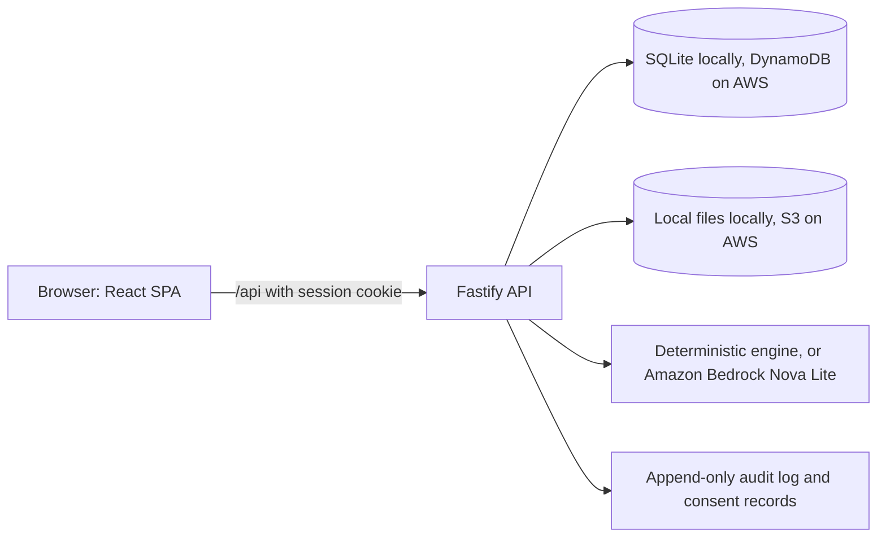

# Makaan

**Proof, fairness and protection for every rental deposit in India.**

Makaan records the condition of a rental home at move-in and at move-out, prices
genuine damage against a city benchmark, and produces one itemized deposit
statement that both sides can read, accept, or dispute.


---

## The problem

India's urban rental market runs on a handshake and a large pile of cash. About
Rs 1,26,042 crore sits locked in security deposits across the top six metros,
and only about 35 percent of Bengaluru tenants get the full amount back. The
root cause is not greed. It is the absence of a baseline: nobody records what
the flat looked like on day one, "normal wear and tear" has no operational
definition, and repair prices are folklore. When the tenancy ends, both sides
argue from memory.

Makaan is the missing evidence layer.

## What it does

- **Capture.** Photograph each area at move-in and move-out. Every photo is
  stored once, hashed with SHA-256, and timestamped. Originals are never
  overwritten.
- **Assess.** An advisory audit compares the two captures and classifies each
  difference as normal wear and tear (never deductible), pre-existing, genuine
  damage (priced inside a city benchmark range), or uncertain (needs review).
- **Settle.** One itemized statement: deposit held, owner claim, approved
  deduction, protected amount, refund owed. Both parties can accept it, and any
  finding can be challenged through a structured dispute trail.

Makaan is **not** a court, an arbitrator, or the Rent Authority. It is **not** a
payment app: money never moves through it. It is **not** a tenant blacklist:
records are tenant-owned, positive-primary and consent based.

## Architecture



The API exposes a typed JSON surface. Every route is validated, every ownership
decision is derived from the session, and every tenancy-scoped route passes
through one authorization guard. The audit engine is an interface with two
implementations, so the product works with no AI credentials and never depends
on a live model call.

## Repository layout

```
apps/
  api/     Fastify API, SQLite store, auth, audit engine, tests
  web/     React SPA, Tailwind and shadcn/ui, tests
packages/
  core/    domain types, money, benchmarks, state rules, deposit math, tests
infra/
  aws/     SAM storage template and deployment runbook
  amplify/ Amplify Hosting build specification
docs/      architecture, security, compliance, runbook
```

## Quickstart

Requirements: Node.js 20 or newer (24 or 26 recommended) and pnpm 9 or newer.

```bash
pnpm install
cp .env.example .env
pnpm --filter @makaan/api seed
pnpm dev
```

- Web app: http://localhost:5173
- API: http://localhost:8787 (health at http://localhost:8787/api/health)

The Vite dev server proxies `/api` to the API, so the browser sees a single
origin.

### Demo accounts

The seed creates one fully worked tenancy in Bengaluru with move-in and move-out
evidence and a completed audit.

| Role     | Email                  | Password           |
| -------- | ---------------------- | ------------------ |
| Landlord | `landlord@makaan.test` | `makaan-demo-2026` |
| Tenant   | `tenant@makaan.test`   | `makaan-demo-2026` |

## How to use it

**Tenant**

1. Sign in and open the tenancy from the overview.
2. In **Capture**, add each area and upload your move-in photos (or review the
   ones already recorded).
3. At the end of the tenancy, add the move-out photos for the same areas.
4. In **Audit**, enter the amount the owner is claiming and run the audit.
5. In **Statement**, read the itemized result, accept it, or open a dispute with
   a reason.

**Landlord**

1. Add a property in **Properties**, including rent and deposit.
2. Invite the tenant by email. The tenant accepts with the same address.
3. Capture the move-in condition, then review the tenant's move-out capture and
   the audit.
4. Accept the statement or challenge a finding.

Both sides see the same numbers, the same evidence, and the same advisory note.

## Scripts

| Command                                | Effect                                |
| -------------------------------------- | ------------------------------------- |
| `pnpm dev`                             | run the API and the web app together  |
| `pnpm build`                           | typecheck and build every package     |
| `pnpm test`                            | run all Vitest suites                 |
| `pnpm typecheck`                       | `tsc --noEmit` across the workspace   |
| `pnpm lint`                            | ESLint across the workspace           |
| `pnpm format`                          | Prettier write                        |
| `pnpm --filter @makaan/api seed`       | seed the demo tenancy                 |
| `pnpm --filter @makaan/api db:migrate` | create or migrate the SQLite database |

## Testing

78 tests across three layers. A test must import the code it claims to test.

| Layer                    | Tool                         | Coverage                                                                                                                     |
| ------------------------ | ---------------------------- | ---------------------------------------------------------------------------------------------------------------------------- |
| Domain (`packages/core`) | Vitest                       | money and paise math, deposit computation, benchmark pricing, state rules, audit schema, fallback engine                     |
| API (`apps/api`)         | Vitest with `fastify.inject` | registration and sessions, CSRF, authorization, tenancy lifecycle, evidence upload and retrieval, audit, statement, disputes |
| Web (`apps/web`)         | Vitest with Testing Library  | real components render, forms are labelled, formatting helpers                                                               |

```bash
pnpm test
```

## Security

- Passwords are hashed with scrypt and a per-user salt.
- Sessions are server side, delivered in an httpOnly, SameSite cookie, and
  revocable. Only a peppered hash of the token is stored.
- Every mutating request requires a session-bound CSRF token.
- Ownership is always derived from the session and the tenancy, never from the
  request body.
- Every request is validated with Zod. Unknown fields are rejected.
- Uploads are checked by magic bytes, size limited, stored under a random key,
  and served only to tenancy members.
- Security headers, strict CORS and rate limiting are enabled.

See `docs/SECURITY.md` for the threat model.

## AWS deployment

The local build is the source of truth. On AWS the same code swaps three
adapters: the store (DynamoDB), the evidence store (S3) and the audit engine
(Bedrock Nova Lite). The S3 and Bedrock adapters are already implemented. The
storage template and the exact runbook, including what remains, are in
`infra/aws/README.md`. The full plan is in `TECHNICAL.md`.

Estimated cost at demo scale: about 0.10 to 0.60 USD per month, inside the free
tier apart from Bedrock.

## Advisory and legal

Every assessment is an advisory opinion produced from the evidence provided. It
is not a legal determination. Deposit rules vary by state: the Model Tenancy Act
2021 is a model law and binds only the states that adopted it. Makaan flags
state deposit caps as warnings and never blocks a user. It does not hold or move
money, and it does not score tenants for housing access.

## AI tooling disclosure

This repository was built during the WeMakeDevs and AWS "First Commit"
hackathon window with AI coding assistance. The domain rules, the tests and the
product decisions are the team's; the scaffolding and drafting were accelerated
with an AI coding agent. No pre-event code is presented as event work.

## Roadmap

- DynamoDB store and Lambda adapter, so the deployed URL is real.
- Benchmark dataset version two: more line items, more cities, sourced.
- Reviewed audits above a value threshold, with an overturn log.
- A consent-based rental passport owned by the tenant.
- A landlord guarantee product through a regulated surety or insurance partner.

## License

MIT. See `LICENSE`.

Makaan. Your home. Your proof.
